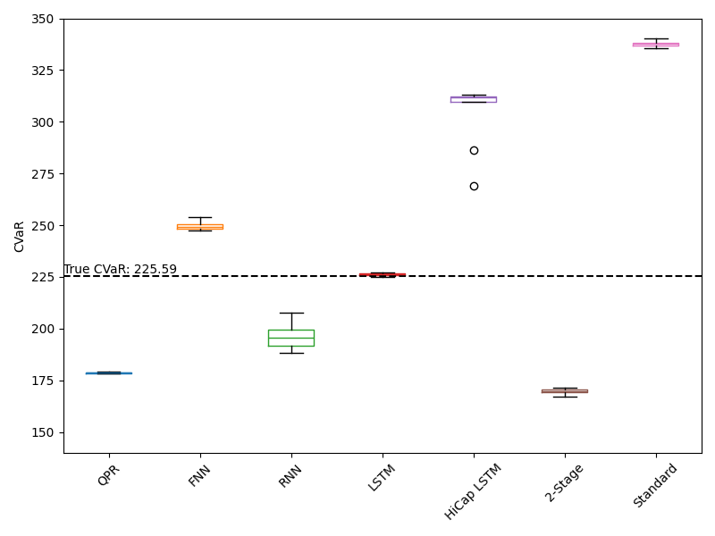

# Metamodeling-Based Nested Simulation Procedures in Financial Engineering and Dynamic Hedging

---

# Nested Simulation Procedures in Financial Engineering

---

## Introduction

- Nested simulation procedures are used to estimate risk measures for complex financial derivatives portfolios
$$\rho(L) = \rho(L(X)), \;\;\; L(X) = \mathbb{E}\left[ Y|X=x \right]\vert_{x=X}  $$
- Involves two levels of Monte Carlo simulations:
  - Outer level: generates underlying risk factors (outer scenarios), $X_i \sim F_X$
  - Inner level: generates scenario-wise samples of portfolio losses (inner replications), $Y_{ij} \sim F_{Y|X_i}$
- Computationally expensive due to nested structure

---

## Common Risk Measures

- Smooth $h$, e.g., quadratic tracking error

$$ \rho(L) = \mathbb{E} \left[ (L - b)^2 \right] $$

- hockey-stick $h$: mean excess loss

$$ \rho(L) = \mathbb{E} \left[ L \cdot \mathbb{1}_{\{L \geq u\}} \right] $$

- indicator $h$: probability of large loss

$$ \rho(L) = \mathbb{E} \left[ \mathbb{1}_{\{L \geq u\}} \right] $$

- Value at Risk (VaR)

- Conditional Value at Risk (CVaR)

---

## Standard Nested Simulation

$$\hat{L}_{N, i} = \frac{1}{N} \sum_{j=1}^N Y_{ij}; ~~~ Y_{ij} \sim F_{Y|X_i} $$

- Proposed by Gordy and Juneja (2010)
- Uses standard MC estimator (sample mean of inner replications)
- Finds optimal growth order of $M$ and $N$
- Zhang et al. (2021) estimate the optimal $M$ and $N$ using a bootstrap method
- Computationally expensive and potentially wasteful use of budget

---

## Nested Simulation Procedures with Metamodeling

1. Regression-based (Broadie et al., 2015)
2. Kernel smoothing (Hong et al., 2017)
4. Kernel ridge regression (Zhang et al., 2022)

**Key ideas**: 
- Pool inner replications from different outer scenarios 
- Use metamodeling techniques to approximate the inner simulation model

---

### Metamodeling Approach

- Use supervised learning models to approximate the inner simulation model
- Treat inner simulation as a black-box function
- Approximate $L(\cdot)$ with $\hat{L}^{\text{SL}}_{M, N}(\cdot)$
- Use trained model to make predictions for all $X \in \mathcal{X}$

---

## Actual Implementation - Training

Use the standard nested simulation procedure to generate training data:

- Generate $M$ outer scenarios ($\mathbf{X} = \{X_{(i)}, i=1,...,M\}$)
- For each outer scenario:
  - Perform $N$ inner simulations
  - Use the sample mean of inner simulations ($\mathbf{Y} = \{\bar{Y}_{(i)}, i=1,...,M\}$) as the loss prediction of the outer scenario

    $$ \bar{Y}_{(i)} = \frac{1}{N} \sum_{j=1}^N Y_{ij}^{(i)} $$

Train a supervised learning model $\hat{f}(\cdot)$ on the training data.

---

## Actual Implementation - Prediction

Use the trained model to make predictions **using the same outer scenarios**:

- Use the trained model to make predictions, i.e., $\hat{L}_{(i)} = \hat{f}(X_{(i)})$

Use the trained model to make predictions **using new outer scenarios**:

- Generate $M$ outer scenarios ($\mathbf{X}^* = \{X^{*}_{(i)}, i=1,...,M\}$)
- Use the trained model to make predictions, i.e., $\hat{L}^{*}_{(i)} = \hat{f}(X^{*}_{(i)})$

## Actual Implementation - Estimation

Use the predicted losses ($\hat{L}_{(i)}$ or $\hat{L}^{*}_{(i)}$) to calculate risk measures (e.g., $95\%$-CVaR).

---

# A Metamodeling-Based Nested Simulation in Dynamic Hedging

---

## Introduction

**Dynamic Hedging** is a risk management technique used in financial engineering to mitigate market risk in financial derivatives.

- **Objective**: Mitigate market risk in VA contracts
- **Instruments**: Stocks, bonds, futures, derivatives
- **Our Simplified Market**: Delta hedging with 1 asset + 1 bond

From an **insurer's perspective**, the goal of dynamic hedging is to mitigate market risk of a sold **index-linked** VA contracts.

---

## Why do we need hedging?

Imagine you just wrote a **put option** on a $100 stock with maturity $T$ and strike $K$.
  - You may want to hedge yourself against the **market risk**.

Without hedging, your **profit and loss** (P&L) is given by:

$$
L = - \max(0, K - S_T)
$$

It is a **random variable** and depends on the **stock price** at maturity $S_T$.

However, you can **hedge** yourself against the market risk by delta hedging.

- **Delta**: $\Delta = \frac{\partial P}{\partial S}$
- This is the amount of stock you need to buy or sell to hedge the option.

---

## Why dynamic?

- The delta of the option changes as the stock price changes.
- You need to rebalance your hedge portfolio as the stock price changes.

It is most ideal to **dynamically** adjust your hedge portfolio as the stock price changes.

- **Dynamic Hedging**: Adjust your hedge **continuously**.
- This is not possible due to 
    - **transaction cost**, 
    - **market impact**, 
    - **time not infinitely divisible**.

Therefore, we need to **dynamically** adjust our hedge portfolio across **time periods**.

---

## Dynamic Hedging Mechanics in Our Simplified Market

For time periods $t = 0,1,\ldots,T-1$:

**Portfolio Value at $t-1$:**
$$
H_{t-1} = \Delta_{t-1}S_{t-1} + B_{t-1}
$$
- $\Delta_t$: Stock units
- $B_t$: Bond amount

**Portfolio Value at $t$:**
$$
H_t^{bf} = \Delta_{t-1}S_t + B_{t-1}e^r
$$

---

## Hedging Error Calculation
**Time-$t$ Hedging Error:**
$$
HE_t = H_t - H_t^{bf} \quad \text{for } t=1,\ldots,T-1
$$

**Total P&L:**
$$
L = H_0 + \sum_{t=1}^{T-1} e^{-rt}HE_t - e^{-rT}H_T^{bf} + V_0
$$
Simplifies to:
$$
L = \sum_{t=0}^{T-1}\Delta_t(e^{-rt}S_t - e^{-r(t+1)}S_{t+1}) + V_0
$$

---

## Nested Simulation Framework
**Key Measures:**
- Real-world measure ($\mathbb{P}$): Outer scenarios
- Risk-neutral measure ($\mathbb{Q}$): Inner simulations

**Data Generation:**
- Outer scenarios: $\mathbf{S}^{(i)} = (S_1^{(i)},\ldots,S_T^{(i)})$
- Inner paths: $\tilde{\mathbf{S}}_t^{(j)} = (\tilde{S}_{t+1}^{(j)},\ldots,\tilde{S}_T^{(j)})$

---

## Standard Nested Simulation Algorithm
1. **Simulate Outer Scenarios**: enerate $M$ paths under $\mathbb{P}$
2. **Initial Inner Simulation**: Estimate $V_0$ and $\Delta_0$ at $t=0$
3. **Scenario Processing**: For each scenario $\mathbf{S}^{(i)}$:
    - Estimate $\Delta_t^{(i)}$ at each $t$
    - Calculate losses $\hat{L}_i^{MC}$
4. **CVaR Estimation**: Sort losses and compute:
   $$
   \widehat{CVaR}_\alpha = \frac{1}{(1-\alpha)M}\sum_{i=\alpha M+1}^M \hat{L}_{(i)}^{MC}
   $$

---

## Overview of Standard Nested Simulation for Dynamic Hedging

- This is the standard nested simulation procedure for dynamic hedging of 1 outer scenario.

---

## Overview of Standard Nested Simulation for Dynamic Hedging

1. Generate $M$ outer scenarios ($S^{(i)}, i=1,...,M$)
    - Geometric Brownian motion with regime-switching
2. For each outer scenario:
    - Perform $N$ inner simulations
    - Estimate hedging loss $L_i$ for scenario $i$
3. Use estimated losses to calculate tail risk measures (e.g., $95\%$-CVaR)
    - Computational budget: $M * N$ simulations
    - Accuracy depends on both $M$ and $N$

---

## Critical Observations of the Standard Procedure
1. **Computational Intensity**
   - Each inner simulation requires $T$ time steps
2. **Data Structure** ($M$ outer scenarios)
   - Features: $T$-dimensional stock paths ($\mathbf{S}$)
   - Labels: Estimated losses ($\hat{L}_i$)
3. **Monte Carlo Properties**
   - Unbiased estimators with variance $\propto 1/N$
4. **Tail Focus**
   - Only tail scenarios ($\approx 5\%$) used for CVaR

---

## A Two-Stage LSTM-based Nested Simulation Procedure

**Intuition**: 
- we want to avoid the **nested** simulation of the standard procedure.
- So we replace the **inner simulation** with a **metamodel**.

### Stage 1: Metamodel Training

1. Generate $M$ outer scenarios ($S^{(i)}, i=1,...,M$)
2. For each outer scenario:
   - Perform $N'$ inner simulations ($N' << N$)
   - Estimate noisy hedging loss $\hat{L}_i$ for scenario $i$
3. Train LSTM metamodel on $(S^{(i)}, \hat{L}_i)$ pairs
4. Use trained metamodel to identify $m$ potential tail scenarios

---

## A Two-Stage LSTM-based Nested Simulation Procedure (Continued)

### Stage 2: Refined Estimation

5. For each identified tail scenario:
   - Perform $N$ inner simulations (same as standard procedure)
   - Estimate refined hedging loss $\hat{L}_i$
6. Use refined loss estimates to calculate risk measures

- Computational budget: $M * N' + m * N$ simulations
- Typically uses $15\% - 30\%$ of standard procedure's budget
- Accuracy comparable to standard procedure with proper safety margin

---

## Key Advantages of a Two-Stage LSTM-based Procedure 

1. Substantial computational savings ($70\% - 85\%$ reduction)
2. Maintains accuracy comparable to standard procedure
3. LSTM metamodel shows resilience to noisy training data
4. Can distinguish between tail and non-tail scenarios effectively
5. Addresses regulatory concerns by using actual simulations for final estimates

---

## A Single-Stage LSTM-based Nested Simulation Procedure

1. Train LSTM metamodel (same as Two-Stage Procedure stage 1)
2. Use trained LSTM to predict losses for all M scenarios
3. Calculate α-CVaR directly using predicted losses

### Key Advantages of a Single-Stage Procedure
- Uses metamodel predictions to estimate risk measures directly
- More efficient than a two-stage procedure
- Can estimate risk measures requiring full loss distribution
- Avoids calibration of safety margin

---

## Experimental Setup

- Estimating 95% CVaR of hedging loss for GMWB contract
- 20-year maturity, monthly delta-hedging (240 periods)
- Regime-switching geometric Brownian motion for underlying asset
- Benchmark: 100,000 outer scenarios, 100,000 inner replications

---

## Metamodel Architectures Compared

1. Regression (MLR, QPR)
2. Feedforward Neural Network (FNN)
3. Recurrent Neural Network (RNN)
4. Long Short-Term Memory (LSTM)

---

## RNN vs LSTM Performance

 

- LSTM overcomes vanishing gradient problem in RNN
- LSTM better captures long-term dependencies in 240-dimensional time series

---

## Regression vs Neural Network Metamodels

 

- Regression metamodels (MLR, QPR) generalize poorly to true data
- Neural network metamodels show better generalization

---

## LSTM Performance with Different Noise Levels

- LSTM metamodels learn true relationship from low and medium-noise datasets
- High-capacity LSTM prone to overfitting with high-noise data

---

## CVaR Estimates Comparison

 

- LSTM metamodels consistently outperform standard procedure
- High-capacity LSTM produces most accurate estimates

---

## Single-Stage Procedure Convergence Analysis

- RRMSE decreases as simulation budget increases
- Higher convergence rate with increased data quantity
- Diminishing returns for increasing inner replications (N > 100)
- CVaR estimator converges at ~O(M^(1/3)) for fixed N=10

---

## Key Findings

1. LSTM metamodels show resilience to high levels of noise in training labels
2. Deep neural networks can learn true complex dynamic hedging model despite noisy data
3. Two-stage procedure addresses regulatory concerns by avoiding direct use of metamodel predictions
4. Single-stage procedure is more efficient and versatile for various risk measures
5. Increasing outer scenarios more beneficial than increasing inner replications
6. High-capacity LSTM requires training labels with lower noise

---

## Future Directions

1. Apply deep neural network metamodels to other financial risk management tasks
2. Investigate impact of label noise on other deep learning models (CNNs, Transformers)
3. Explore optimal network architectures for different simulation models

---

<!-- 
---

## Project 3: Transfer Learning for Rapid Adaptation of Deep Neural Network Metamodels in Dynamic Hedging

---

### Introduction

- Challenge: Adapting deep neural network metamodels to changing conditions
- Problem: Retraining LSTMs from scratch is computationally expensive
- Key issues:
  - Rapid adaptation to new market conditions
  - Efficient incorporation of new VA contract data
  - Balancing model accuracy and computational costs

This project explores transfer learning (TL) to develop adaptable, efficient metamodels for VA dynamic hedging.

---

### Transfer Learning Solution

- Retraining from scratch is computationally inefficient
- TL enables reuse of pre-trained models
- Benefits:
  - Reduced training time and computational resources
  - Enhanced model generalization
  - Quick adaptation to new conditions

---

### Research Objectives

1. Apply TL to dynamic hedging of VAs using RNN and LSTM metamodels
2. Propose a novel TL framework for nested simulation in dynamic hedging
3. Evaluate performance on VA contract datasets
4. Compare TL approach with training from scratch

---

### Transfer Learning Framework

- Pre-train deep neural network on contracts with abundant simulation data
- Fine-tune on smaller dataset of new contracts/market conditions
- Leverages shared features between VA contracts
- Computational savings:
  1. Reduced fine-tuning time
  2. Fewer data points needed for good performance

---

### Key Components

- **Domain** $\mathcal{D}$: Feature space $\mathcal{X}$ + Probability distribution $F$
- **Task** $\mathcal{T}$: Label space $\mathcal{Y}$ + Predictive function $f: \mathcal{X} \rightarrow \mathcal{Y}$

### Source vs. Target

| Component | Source | Target |
|-----------|--------|--------|
| Domain    | $\mathcal{D}_{\text{So}} = \{\mathcal{X}_{\text{So}}, F_{\text{So}}(X)\}$ | $\mathcal{D}_{\text{Ta}} = \{\mathcal{X}_{\text{Ta}}, F_{\text{Ta}}(x)\}$ |
| Task      | $\mathcal{T}_{\text{So}} = \{\mathcal{Y}_{\text{So}}, f_{\text{So}}(\cdot)\}$ | $\mathcal{T}_{\text{Ta}} = \{\mathcal{Y}_{\text{Ta}}, f_{\text{Ta}}(\cdot)\}$ |

---

### Transfer Learning in VA Context

- **Input Features** $X$: Risk factors from outer simulation
- **Output Labels** $L$: Contract losses at each time step
- **Goal**: Improve $f_{\text{Ta}}(\cdot)$ using knowledge from $\mathcal{D}_{\text{So}}$ and $f_{\text{So}}(\cdot)$

### Applications

- Adapt LSTM metamodels to new VA contracts
- Transfer knowledge between different market conditions
- Reduce computational cost for nested simulations

---

### Transfer Learning Techniques

- Fine-tuning
- Layer freezing
- Multi-task learning

---

### Fine-tuning 

1. Pre-train model on large dataset (source task)
2. Transfer learned features to new model
3. Train on smaller dataset (target task) with lower learning rate

### Key Considerations:
- Similarity between source and target tasks
- Appropriate learning rate

---

### Fine-tuning Algorithm for LSTM Metamodels in VA Hedging

**Input**: 
- Source dataset: $\mathcal{D}_{\text{So}} = \{(X_{\text{So}}^{(i)}, L_{\text{So}}^{(i)})\}_{i=1}^{M_{\text{So}}}$
- Target dataset: $\mathcal{D}_{\text{Ta}} = \{(X_{\text{Ta}}^{(i)}, L_{\text{Ta}}^{(i)})\}_{i=1}^{M_{\text{Ta}}}$

**Algorithm**:
1. Train source LSTM metamodel $f_{\text{So}}(\cdot; \theta_{\text{So}})$ on $\mathcal{D}_{\text{So}}$:
   $$\theta_{\text{So}} = \arg\min_{\theta} \frac{1}{M_{\text{So}}} \sum_{i=1}^{M_{\text{So}}} (f_{\text{So}}(X_{\text{So}}^{(i)}; \theta) - L_{\text{So}}^{(i)})^2.$$

2. Initialize target model: $\theta_{\text{Ta}} \leftarrow \theta_{\text{So}}$.

3. Fine-tune $f_{\text{Ta}}(\cdot; \theta_{\text{Ta}})$ on $\mathcal{D}_{\text{Ta}}$:
   $$\theta_{\text{Ta}} = \arg\min_{\theta} \frac{1}{M_{\text{Ta}}} \sum_{i=1}^{M_{\text{Ta}}} (f_{\text{Ta}}(X_{\text{Ta}}^{(i)}; \theta) - L_{\text{Ta}}^{(i)})^2.$$

---

### Layer Freezing

**Input**: 
- Source dataset: $\mathcal{D}_{\text{So}} = \{(X_{\text{So}}^{(i)}, L_{\text{So}}^{(i)})\}_{i=1}^{M_{\text{So}}}$
- Target dataset: $\mathcal{D}_{\text{Ta}} = \{(X_{\text{Ta}}^{(i)}, L_{\text{Ta}}^{(i)})\}_{i=1}^{M_{\text{Ta}}}$

**Algorithm**:
1. Train source model $f_{\text{So}}(\cdot; \theta_{\text{So}})$ on $\mathcal{D}_{\text{So}}$
2. Initialize $\theta_{\text{Ta}} \leftarrow \theta_{\text{So}}$
3. Freeze LSTM layers in $\theta_{\text{Ta}}$
4. Fine-tune unfrozen layers of $f_{\text{Ta}}(\cdot; \theta_{\text{Ta}})$ on $\mathcal{D}_{\text{Ta}}$

**Output**: Adapted model $f_{\text{Ta}}(\cdot; \theta_{\text{Ta}})$ with frozen LSTM layers

**Note**: Choice of layers to freeze depends on similarity between source and target tasks

---

### Experiment Setup

### Data Generating Process
- Low noise dataset from standard nested simulation procedure
- Source tasks: $M_{\text{So}} = 50,000$ samples, $N_{\text{So}} = 100$ inner replications
- Target tasks: $M_{\text{Ta}} = 2,000$ samples, $N_{\text{Ta}} = 100$ inner replications
- 10% of data used for validation (early stopping)

--- 

### VA Contracts and Asset Models
| Contract | Asset Model | Lapse | $M_{\text{So}}$ | $M_{\text{Ta}}$ |
|----------|-------------|-------|----------------|----------------|
| GMMB     | GBM         | No    | 50,000         | N/A            |
| GMMB     | RS-GBM      | No    | 50,000         | 2,000          |
| GMMB     | RS-GBM      | Static| 50,000         | 2,000          |
| GMMB     | RS-GBM      | Dynamic| 50,000        | 2,000          |
| GMWB     | RS-GBM      | Dynamic| N/A           | 2,000          |

---
### Transfer to GMMB (No Lapse → Static Lapse)

---
### Fine-Tuning on GMMB (Static → Dynamic Lapse)

- Performance depends on source-target similarity
- Fine-tuning from static lapse → faster convergence
- Appropriate source task selection is crucial

---

### Layer Freezing on GMMB (Static → Dynamic Lapse)

- Freezing LSTM layers → higher validation error
- Freezing FC layer → lower error, better generalization
- Choice of frozen layers impacts performance

---

### Transfer Across Contract Types (GMMB → GMWB)

---

### Performance Comparison (GMMB → GMWB)

| Model | Training MSE | True MSE |
|-------|--------------|----------|
| Without TL | 0.3588 | 0.4188 |
| Fine Tuning | 0.1690 | 0.1780 |
| Layer Freezing | 0.1828 | 0.2295 |
| Extensive Training | 0.0853 | 0.0726 |

- Fine-tuning outperforms layer freezing for dissimilar tasks
- Both TL methods better than training from scratch
- Extensive training still superior with abundant data

### Tail Scenario and CVaR Predictions

- Consistent finding with training history and MSE table
- Fine-tuning outperforms layer freezing
- Highlights the importance of task similarity in TL

---

# Key Findings

1. TL improves stability and performance with limited data
2. Source-target similarity crucial for effective transfer
3. Fine-tuning generally outperforms layer freezing for dissimilar tasks
4. Layer freezing can be effective for closely related tasks
5. TL enables faster adaptation to new VA contracts and features
6. Choice of frozen layers impacts performance on target tasks

---

### Multi-task Learning Framework

- LSTM layers shared across multiple tasks
- Task-specific fully connected layers
- Objective: Minimize sum of loss functions across all tasks

---

### Multi-task Learning Framework 

**Input**: 
- Set of $K$ tasks $\{\mathcal{T}_k\}_{k=1}^K$ with datasets $\mathcal{D}_k = \{(X_k^{(i)}, L_k^{(i)})\}_{i=1}^{M_k}$
- Shared parameters $\theta_0$ and task-specific parameters $\theta_k$ for each task $k$
  
**Algorithm**:
1. Train the multi-head LSTM metamodel on all $K$ tasks simultaneously by minimizing the multi-task loss function:

   $$\min_{\theta_0, \{\theta_k\}_{k=1}^K} \sum_{k=1}^K \frac{1}{M_k} \sum_{i=1}^{M_k} \left( f_i(X_k^{(i)}; \theta_0, \theta_k) - L_k^{(i)} \right)^2$$

2. Update both the shared parameters $\theta_0$ and task-specific parameters $\{\theta_k\}_{k=1}^K$ simultaneously using backpropagation and gradient descent with learning rate $\alpha$

**Output**: Trained multi-task LSTM metamodel $f(\cdot; \theta_0, \{\theta_k\}_{k=1}^K)$ for all $K$ tasks

---

### Multi-task Learning of GMMB and GMWB

---

### Conclusions

1. TL framework accelerates LSTM metamodel training for VA dynamic hedging
2. Fine-tuning improves training stability and predictive accuracy
3. Layer freezing effectiveness depends on task similarity
4. Multi-task learning enhances generalization across VA contracts
5. Significant advancement in robust risk management for VAs

---

### Future Directions

- Broader applications of transfer learning in financial modeling
- Exploration of other deep learning architectures for metamodeling
- Integration of transfer learning techniques in regulatory frameworks

--- -->

# Deep Dynamic Hedging of Variable Annuities

---

## Introduction

- We want to use an **Reinforcement Learning** (RL)a agent to hedge VA contracts.

Instead of using a **delta** hedging strategy, there are several reasons we want to use RL:

1. **Transaction costs** are too high for delta hedging.
2. We want **flexibility** in our hedging strategy.
3. We don't want to assume any **asset model** to begin with.

**Key Advantages of RL:**
- Learns directly from market dynamics
- Handles discrete hedging periods
- Incorporates transaction costs natively
- Adapts to changing market conditions

---

## How to do Deep Dynamic Hedging?

**Key Components:**
1. A **Markov Decision Process** (MDP) that describes the dynamic hedging problem
2. A policy network that outputs a **hedging action** based on the current state
3. A **reward function** that measures the performance of the hedging action

---

## Implementation Challenges

**State Representation:**
- Translated directly from the standard nested simulation procedure

**Reward Engineering:**
- Balancing immediate vs terminal rewards
- Penalizing excessive trading

**Training Considerations:**
- Market regime transitions
- Rare event simulation
- Portfolio liquidity constraints

---

## What We've Tried

1. Applied Proximal Policy Optimization (PPO) to VA hedging
2. Compared recurrent PPO with LSTM to standard PPO
3. Tested PPO against traditional delta hedging
4. Experimented with different asset models and VA riders

---

## Recurrent PPO vs Deep Hedging

- Compared recurrent PPO with LSTM to deep hedging algorithm
- Both methods applied to GMMB rider
- Recurrent PPO shows competitive performance

---

## Standard PPO vs Recurrent PPO

 

- Recurrent PPO outperforms standard PPO for both GBM and regime-switching GBM
- LSTM component helps capture historical information, improving hedging decisions

---

## PPO vs Delta Hedging with Transaction Costs

 

- Delta hedging outperforms PPO with low transaction costs
- PPO adapts better as transaction costs increase
- Demonstrates PPO's ability to learn from the environment

---

## PPO Performance with Model Information

- Tested PPO with and without model information (asset model, current liability value)
- Surprisingly, additional information didn't significantly improve performance
- Suggests PPO can learn effective strategies without explicit model knowledge

---

## Challenges: PPO with GMWB

- PPO struggled with GMWB rider
- Hedging errors more dispersed compared to GMMB
- Indicates need for more training or enhanced approaches for complex VA products

---

## Where We've Faced Challenges

1. GMWB hedging: PPO struggled with increased complexity
2. Sample efficiency: More episodes needed for satisfactory performance on complex products
3. Generalization: Difficulty in transferring knowledge between different VA riders
4. Computational costs: High resources required for training, especially for complex scenarios
5. Model-free limitations: Current approach may not fully leverage available financial knowledge

---

## Future Directions: Adressing the Challenges

1. Enhance sample efficiency of RL algorithms for complex VA products
2. Develop more robust transfer learning techniques between VA types
3. Explore hybrid approaches combining model-based and model-free methods
4. Investigate meta-learning for faster adaptation to new market conditions
5. Improve interpretability of RL models for regulatory considerations
6. Extend to more complex market models (e.g., stochastic volatility, jump diffusion)
