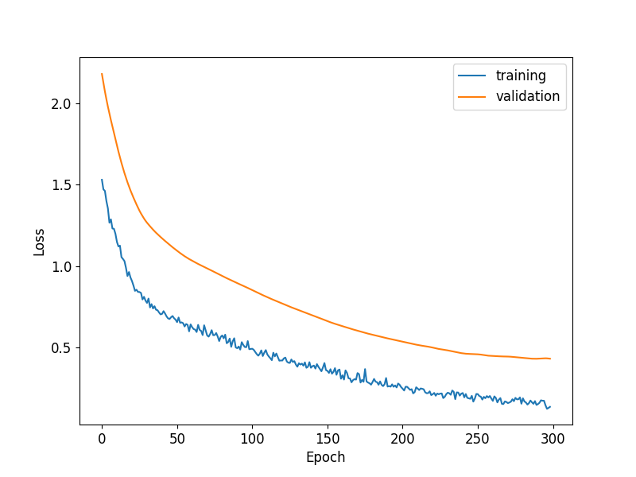
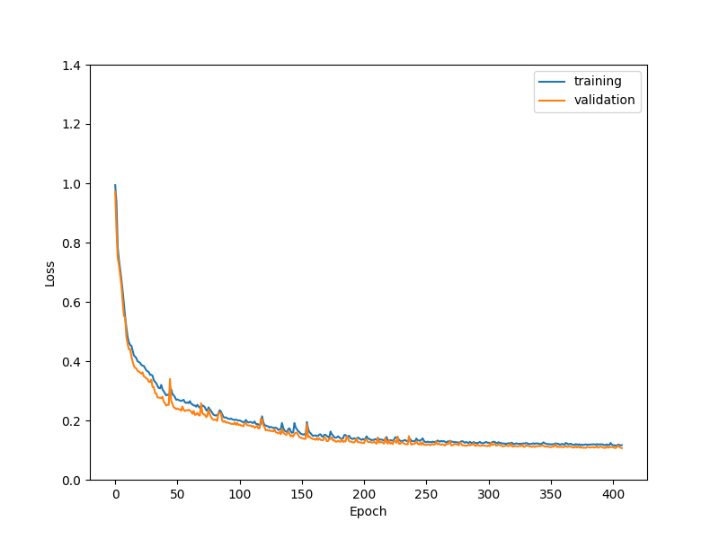
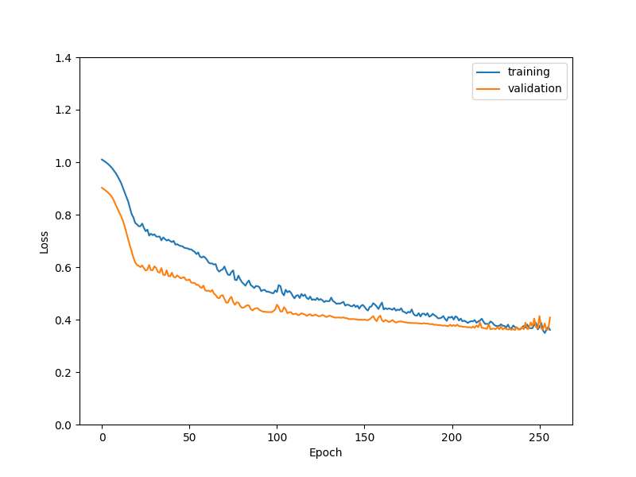
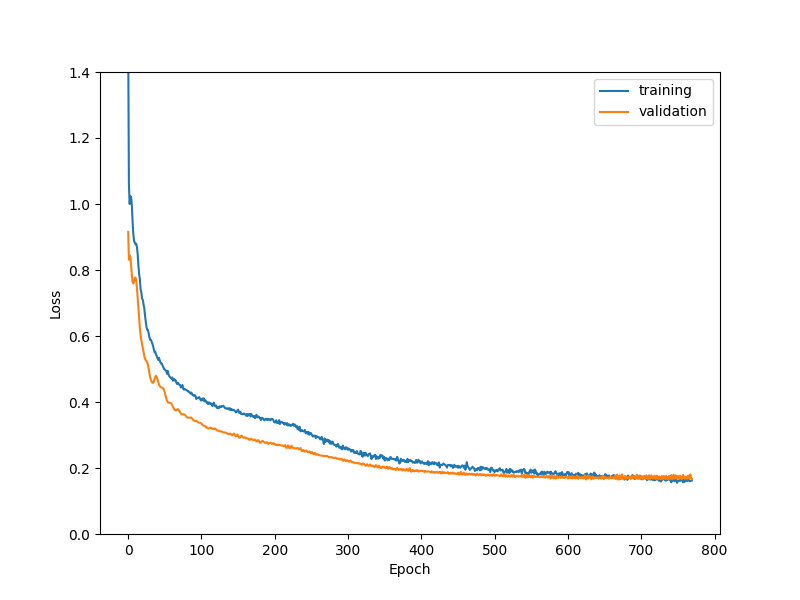
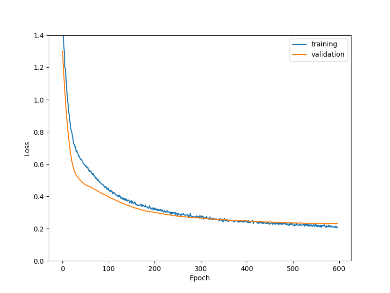

# Transfer Learning for Metamodeling Nested Simulation in VA Contracts

---

## Outline

1. Introduction to Nested Simulation
2. Challenges in VA Contract Valuation
3. Metamodeling Approach
4. Transfer Learning Fundamentals
5. Application to VA Contracts
6. Experimental Results
7. Conclusions

---

## Introduction to Nested Simulation

- **Nested simulation**: A computational approach involving two layers of simulations
  - Outer scenarios: Represent possible future states
  - Inner scenarios: Estimate conditional expectations (e.g., losses) at each outer scenario

- **Applications**: Risk management, dynamic hedging, and regulatory compliance

- **Challenge**: Computational intensity due to multiple layers of simulations

---

## Variable Annuity (VA) Contracts

- Financial products offering investment returns with insurance guarantees
- Complex financial instruments with long-term horizons
    - Guaranteed minimum maturity benefits (GMMB)
    - Guaranteed minimum accumulation benefits (GMAB)
    - Guaranteed minimum withdrawal benefits (GMWB)

---

## Computational Challenges for Simulating VA Contracts

- Nested simulation for VA contracts is computationally intensive:
  - Thousands of outer scenarios
  - Hundreds/thousands of inner scenarios per outer scenario
  - Complex contract features and market dynamics

- **Real-world impact**: Delays in risk assessment and decision-making

---

## Metamodeling Approach

- **Metamodel**: A model that approximates the relationship between inputs and outputs of a complex simulation

- **Goal**: Replace expensive inner simulations with a fast approximation

- **Benefits**:
  - Significant reduction in computational time
  - Enables more frequent risk assessments
  - Supports real-time decision making (?)

---

## Traditional Metamodeling Approaches

- Multiple linear regression
- Quadratic polynomial regression
- Feedforward neural networks
- Recurrent neural networks
- Long short-term memory (LSTM) networks

**Limitation**: 

- Each new VA contract or valuation date requires building a new metamodel from scratch

---

## Transfer Learning: Fundamentals

- **Core idea**: Knowledge gained from solving one problem can be applied to a different but related problem

- **Advantages**:
  - Reduces training data requirements
  - Accelerates learning process
  - Improves model performance

---
## Neural Networks & Transfer Learning

---

## Transfer Learning: Approaches

- **Feature-based Transfer**: Extract and transfer knowledge at feature representation level
  - Example: Domain adaptation via feature alignment ([Tzeng et al., 2017](https://arxiv.org/abs/1702.05464))
  
- **Instance-based Transfer**: Reweight source domain instances for target domain relevance
  - Example: TrAdaBoost for cross-domain classification ([Dai et al., 2007](https://dl.acm.org/doi/10.1145/1273496.1273521))
  
- **Parameter-based Transfer**: Share and fine-tune model parameters between domains
  - Example: Pre-trained neural networks in computer vision ([Yosinski et al., 2014](https://arxiv.org/abs/1411.1792))

---

## Mathematical Formulation of Transfer Learning

In supervised learning, a **domain** $\mathcal{D}$ consists of:
- Feature space $\mathcal{X}$
- Marginal probability distribution $F$

A **task** $\mathcal{T}$ consists of:
- Label space $\mathcal{Y}$
- Predictive function $f: \mathcal{X} \rightarrow \mathcal{Y}$

---

## Transfer Learning Framework

- **Source domain**: $\mathcal{D}_{\text{So}} = \{\mathcal{X}_{\text{So}}, F_{\text{So}}(\mathbf{X})\}$
- **Source task**: $\mathcal{T}_{\text{So}} = \{\mathcal{Y}_{\text{So}}, f_{\text{So}}(\cdot)\}$
- **Target domain**: $\mathcal{D}_{\text{Ta}} = \{\mathcal{X}_{\text{Ta}}, F_{\text{Ta}}(\cdot)\}$
- **Target task**: $\mathcal{T}_{\text{Ta}} = \{\mathcal{Y}_{\text{Ta}}, f_{\text{Ta}}(\cdot)\}$

In our context of metamodeling nested simulation for VA contracts:

- $\mathcal{X}_{\text{So}}$ and $\mathcal{X}_{\text{Ta}}$ include input features derived from the outer simulation
- $F_{\text{So}}$ and $F_{\text{Ta}}$ are the outer simulation model that simulates the outer scenarios
- $\mathcal{Y}_{\text{So}}$ and $\mathcal{Y}_{\text{Ta}}$ include the VA contract losses
- $f_{\text{So}}$ and $f_{\text{Ta}}$ are the true contract losses that we want to approximate 

---

## Relating to Previous Work

In the previous chapter, we have $\mathcal{D}_{\text{So}} = \mathcal{D}_{\text{Ta}}$ and $\mathcal{T}_{\text{So}} = \mathcal{T}_{\text{Ta}}$.

- We trained the LSTM network on a simulation dataset
- We used the same LSTM network to approximate the contract losses on the same data generating process

However, as new contract features are introduced, we want to transfer previous knowledge when

- we have **limited simulation budget** (data is scarce)
- we want to save the cost of **building a new metamodel from scratch**

---

## Transfer Learning Implementation

**Goal**: Improve learning when $\mathcal{D}_{\text{So}} \neq \mathcal{D}_{\text{Ta}}$ or $\mathcal{T}_{\text{So}} \neq \mathcal{T}_{\text{Ta}}$

1. Train source model $f_{\text{So}}(\cdot ; \theta_{\text{So}})$ on dataset $\mathcal{D}_{\text{So}} = \{(X_{\text{So}}^{(i)}, L_{\text{So}}^{(i)})\}_{i=1}^{M_{\text{So}}}$

2. Transfer knowledge by initializing target model with $\theta_{\text{So}}$

3. Fine-tune $f_{\text{Ta}}(\cdot ; \theta_{\text{Ta}})$ on target domain $\mathcal{D}_{\text{Ta}}$

---

### Fine-tuning Algorithm for LSTM Metamodels in VA Hedging

**Input**: 
- Source dataset: $\mathcal{D}_{\text{So}} = \{(X_{\text{So}}^{(i)}, L_{\text{So}}^{(i)})\}_{i=1}^{M_{\text{So}}}$, Target dataset: $\mathcal{D}_{\text{Ta}} = \{(X_{\text{Ta}}^{(i)}, L_{\text{Ta}}^{(i)})\}_{i=1}^{M_{\text{Ta}}}$

**Algorithm**:
1. Train source LSTM metamodel $f_{\text{So}}(\cdot; \theta_{\text{So}})$ on $\mathcal{D}_{\text{So}}$:
   $$\theta_{\text{So}} = \arg\min_{\theta} \frac{1}{M_{\text{So}}} \sum_{i=1}^{M_{\text{So}}} (f_{\text{So}}(X_{\text{So}}^{(i)}; \theta) - L_{\text{So}}^{(i)})^2.$$

2. Initialize target model: $\theta_{\text{Ta}} \leftarrow \theta_{\text{So}}$.

3. Fine-tune $f_{\text{Ta}}(\cdot; \theta_{\text{Ta}})$ on $\mathcal{D}_{\text{Ta}}$:
   $$\theta_{\text{Ta}} = \arg\min_{\theta} \frac{1}{M_{\text{Ta}}} \sum_{i=1}^{M_{\text{Ta}}} (f_{\text{Ta}}(X_{\text{Ta}}^{(i)}; \theta) - L_{\text{Ta}}^{(i)})^2.$$

---

### Layer Freezing

**Input**: 
- Source dataset: $\mathcal{D}_{\text{So}} = \{(X_{\text{So}}^{(i)}, L_{\text{So}}^{(i)})\}_{i=1}^{M_{\text{So}}}$, Target dataset: $\mathcal{D}_{\text{Ta}} = \{(X_{\text{Ta}}^{(i)}, L_{\text{Ta}}^{(i)})\}_{i=1}^{M_{\text{Ta}}}$

**Algorithm**:
1. Train source model $f_{\text{So}}(\cdot; \theta_{\text{So}})$ on $\mathcal{D}_{\text{So}}$
2. Initialize $\theta_{\text{Ta}} \leftarrow \theta_{\text{So}}$
3. Freeze LSTM layers in $\theta_{\text{Ta}}$
4. Fine-tune unfrozen layers of $f_{\text{Ta}}(\cdot; \theta_{\text{Ta}})$ on $\mathcal{D}_{\text{Ta}}$

**Output**: Adapted model $f_{\text{Ta}}(\cdot; \theta_{\text{Ta}})$ with frozen LSTM layers

**Note**: Choice of layers to freeze depends on similarity between source and target tasks

---

## Transfer Learning for VA Contracts

**Key insight**: Different VA contracts share underlying financial and mathematical structures

**Application approaches**:
- Transfer between different contract types
- Transfer between different valuation dates
- Transfer between different market conditions

---

## VA Contracts and Asset Models
| Contract | Asset Model | Lapse | $M_{\text{So}}$ | $M_{\text{Ta}}$ |
|----------|-------------|-------|----------------|----------------|
| GMMB     | GBM         | No    | 50,000         | N/A            |
| GMMB     | RS-GBM      | No    | 50,000         | 2,000          |
| GMMB     | RS-GBM      | Static| 50,000         | 2,000          |
| GMMB     | RS-GBM      | Dynamic| 50,000        | 2,000          |
| GMWB     | RS-GBM      | Dynamic| N/A           | 2,000          |

All training data is generated by the standard procedure with 100 inner replications.

---

# Learning Lapse Features

### From No Lapse to Static Lapse

---

## Learning Curves: Without Transfer Learning

 

*Figure 1: The effect of number of training samples on the performance of the metamodel*

- *Left: 50000 samples; right: 2000 samples*

---

## Learning Curves: With Transfer Learning

 

*Figure 2: The effect of transfer learning on limited training samples*
- *Left: fine-tuning; right: layer freezing*

---

## Experimental Setup

- **Source domain**: VA contract with specific features/parameters
- **Target domain**: New VA contract or same contract with different features
- **Architecture**: LSTM-based metamodel
- **Transfer approach**: Pre-trained weights from source model

---

# Learning Dynamic Lapse

### The Effect of Similarity between Source and Target

---

## Learning Curves: Learning Dynamic Lapse

 

*Figure 3: The effect of similarity between source and target on the convergence speed*
- *Left: from No Lapse; right: from Static Lapse*

---

## Results: Accuracy Comparison

| **Lapse Type** | **Extensive** | **Fine-tuning** | **Layer Freezing** | **Without TL** |
|----------------|---------------|-----------------|---------------------|----------------|
| No Lapse       | N/A           | 0.4894          | **0.3361**          | N/A            |
| Static Lapse   | N/A           | 0.0794          | 0.0763              | N/A            |
| Dynamic Lapse  | **0.0587**    | N/A             | N/A                 | **0.2950**     |

*Table 1: Comparison of different TL methods on GMMB contracts (best MSE values)*

---

## Learning Curves: Effect of Similarity

 

*Figure 4: The effect of similarity between source and target on the convergence speed*
- *Left: from No Lapse; right: from Static Lapse*

---

# Transfer Knowledge to other Contract Types

### From GMMB to GMWB Contract

---

## Learning Curves: Transfer Knowledge to other Contract Types

 

*Figure 5: Learning curves of GMWB contracts*
- *Left: 50000 samples; right: 2000 samples*

---

## Learning Curves: Effect of Similarity

 

*Figure 6: Comparison of different TL methods on GMWB contracts*
- *Left: fine-tuning; right: layer freezing*

---

### Performance Comparison (GMMB → GMWB)

| Model | Training MSE | True MSE |
|-------|--------------|----------|
| Without TL | 0.3588 | 0.4188 |
| Fine Tuning | 0.1690 | 0.1780 |
| Layer Freezing | 0.1828 | 0.2295 |
| Extensive Training | 0.0853 | 0.0726 |

- Fine-tuning outperforms layer freezing for dissimilar tasks
- Both TL methods better than training from scratch
- Extensive training still superior with abundant data

---

## Practical Implementation

- **Framework**: TensorFlow/PyTorch implementation
- **Workflow**:
  1. Train base model on source contract
  2. Freeze early layers
  3. Fine-tune later layers on target contract
  4. Deploy for production use

**PyTorch** is recommended.
- It is more flexible and easier to customize
- It is more intuitive and easier to understand 
- It is more efficient and easier to debug

---

## Multi-task Learning

- LSTM layers shared across multiple tasks
- Task-specific fully connected layers
- Objective: Minimize sum of loss functions across all tasks

---

## Multi-task Learning Framework 

**Input**: Set of $K$ tasks $\{\mathcal{T}_k\}_{k=1}^K$ with datasets $\mathcal{D}_k = \{(X_k^{(i)}, L_k^{(i)})\}_{i=1}^{M_k}$, shared parameters $\theta_0$, and task-specific parameters $\theta_k$ for each task $k$
  
**Algorithm**:
1. Train the multi-head LSTM metamodel on all $K$ tasks simultaneously by minimizing the multi-task loss function:

   $$\min_{\theta_0, \{\theta_k\}_{k=1}^K} \sum_{k=1}^K \frac{1}{M_k} \sum_{i=1}^{M_k} \left( f_i(X_k^{(i)}; \theta_0, \theta_k) - L_k^{(i)} \right)^2$$

2. Update both the shared parameters $\theta_0$ and task-specific parameters $\{\theta_k\}_{k=1}^K$ simultaneously using backpropagation and gradient descent with learning rate $\alpha$

**Output**: Trained multi-task LSTM metamodel $f(\cdot; \theta_0, \{\theta_k\}_{k=1}^K)$ for all $K$ tasks

---

## Multi-task Learning: GMMB and GMWB

 

*Figure 5: Multi-task learning of GMMB and GMWB*
- *Left: total MSE; right: individual MSE*

---

## Multi-task Learning: GMMB and GMWB

 

*Figure 6: Training without multi-task learning*
- *Left: GMMB; right: GMWB*

---

## Challenges & Limitations

- Determining optimal layer freezing strategy
- Handling significantly different contract structures
- Quantifying uncertainty in transfer learning predictions
- Regulatory acceptance of black-box approaches

---

## Conclusions

- Transfer learning significantly improves metamodeling for VA contracts:
  - Faster training convergence
  - Better prediction accuracy
  - Reduced computational requirements

- Enables more frequent risk assessments and faster decision-making

---

## Future Directions

- Incorporating domain knowledge into transfer process
- Extension to other insurance and financial products
- Multi-task learning with more than two tasks

