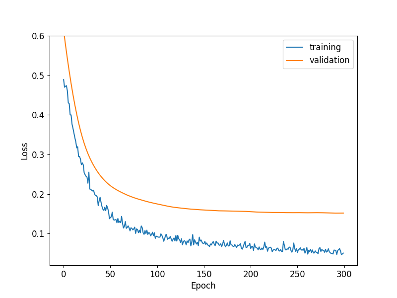
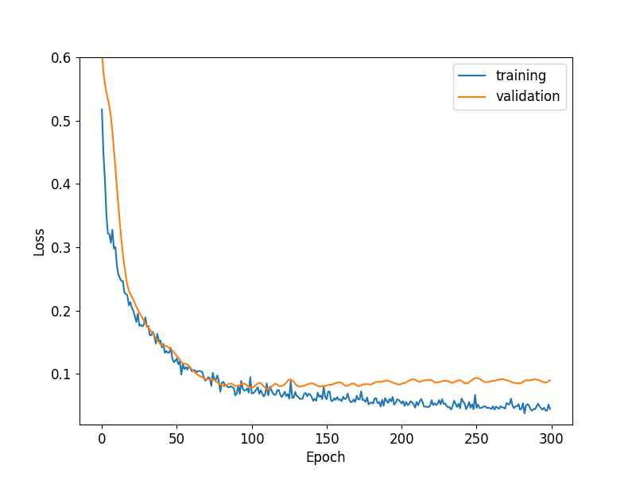

# Transfer Learning for Metamodeling Nested Simulation in VA Contracts

---

## Outline

1. Introduction to Nested Simulation
2. Challenges in VA Contract Valuation
3. Metamodeling Approach
4. Transfer Learning Fundamentals
5. Application to VA Contracts
6. Experimental Results
7. Conclusions

---

## Introduction to Nested Simulation

- **Nested simulation**: A computational approach involving two layers of simulations
  - Outer scenarios: Represent possible future states
  - Inner scenarios: Estimate conditional expectations (e.g., losses) at each outer scenario

- **Applications**: Risk management, dynamic hedging, and regulatory compliance

- **Challenge**: Computational intensity due to multiple layers of simulations

---

## Variable Annuity (VA) Contracts

- Financial products offering investment returns with insurance guarantees
- Complex financial instruments with long-term horizons
    - Guaranteed minimum maturity benefits (GMMB)
    - Guaranteed minimum accumulation benefits (GMAB)
    - Guaranteed minimum withdrawal benefits (GMWB)

---

## Computational Challenges for Simulating VA Contracts

- Nested simulation for VA contracts is computationally intensive:
  - Thousands of outer scenarios
  - Hundreds/thousands of inner scenarios per outer scenario
  - Complex contract features and market dynamics

- **Real-world impact**: Delays in risk assessment and decision-making

---

## Metamodeling Approach

- **Metamodel**: A model that approximates the relationship between inputs and outputs of a complex simulation

- **Goal**: Replace expensive inner simulations with a fast approximation

- **Benefits**:
  - Significant reduction in computational time
  - Enables more frequent risk assessments
  - Supports real-time decision making (?)

---

## Traditional Metamodeling Approaches

- Multiple linear regression
- Quadratic polynomial regression
- Feedforward neural networks
- Recurrent neural networks
- Long short-term memory (LSTM) networks

**Limitation**: 

- Each new VA contract or valuation date requires building a new metamodel from scratch

---

## Transfer Learning: Fundamentals

- **Core idea**: Knowledge gained from solving one problem can be applied to a different but related problem

- **Advantages**:
  - Reduces training data requirements
  - Accelerates learning process
  - Improves model performance

---
## Neural Networks & Transfer Learning

---

## Transfer Learning: Approaches

- **Feature-based Transfer**: Extract and transfer knowledge at feature representation level
  - Example: Domain adaptation via feature alignment ([Tzeng et al., 2017](https://arxiv.org/abs/1702.05464))
  
- **Instance-based Transfer**: Reweight source domain instances for target domain relevance
  - Example: TrAdaBoost for cross-domain classification ([Dai et al., 2007](https://dl.acm.org/doi/10.1145/1273496.1273521))
  
- **Parameter-based Transfer**: Share and fine-tune model parameters between domains
  - Example: Pre-trained neural networks in computer vision ([Yosinski et al., 2014](https://arxiv.org/abs/1411.1792))

---

## Transfer Learning for VA Contracts

**Key insight**: Different VA contracts share underlying financial and mathematical structures

**Application approaches**:
- Transfer between different contract types
- Transfer between different valuation dates
- Transfer between different market conditions

---

# Learning Lapse Features

### From No Lapse to Static Lapse

---

## Learning Curves: Without Transfer Learning

 

*Figure 1: The effect of number of training samples on the performance of the metamodel*

- *Left: 50000 samples; right: 2000 samples*

---

## Learning Curves: With Transfer Learning

 

*Figure 2: The effect of transfer learning on limited training samples*
- *Left: fine-tuning; right: layer freezing*

---

## Experimental Setup

- **Source domain**: VA contract with specific features/parameters
- **Target domain**: New VA contract or same contract with different features
- **Architecture**: LSTM-based metamodel
- **Transfer approach**: Pre-trained weights from source model

---

# Learning Dynamic Lapse

### The Effect of Similarity between Source and Target

---

## Learning Curves: Learning Dynamic Lapse

 

*Figure 3: The effect of similarity between source and target on the convergence speed*
- *Left: from No Lapse; right: from Static Lapse*

---

## Results: Accuracy Comparison

| **Lapse Type** | **Extensive** | **Fine-tuning** | **Layer Freezing** | **Without TL** |
|----------------|---------------|-----------------|---------------------|----------------|
| No Lapse       | N/A           | 0.4894          | **0.3361**          | N/A            |
| Static Lapse   | N/A           | 0.0794          | 0.0763              | N/A            |
| Dynamic Lapse  | **0.0587**    | N/A             | N/A                 | **0.2950**     |

*Table 1: Comparison of different TL methods on GMMB contracts (best MSE values)*

---

# Transfer Knowledge to other Contract Types

### From GMMB to GMWB Contract

---

## Learning Curves: Transfer Knowledge to other Contract Types

 

*Figure 4: The effect of transfer learning on GMWB contracts*
- *Left: extensive training on target task; right: without TL*
---

## Practical Implementation

- **Framework**: TensorFlow/PyTorch implementation
- **Workflow**:
  1. Train base model on source contract
  2. Freeze early layers
  3. Fine-tune later layers on target contract
  4. Deploy for production use

---

## Challenges & Limitations

- Determining optimal layer freezing strategy
- Handling significantly different contract structures
- Quantifying uncertainty in transfer learning predictions
- Regulatory acceptance of black-box approaches

---

## Conclusions

- Transfer learning significantly improves metamodeling for VA contracts:
  - Faster training convergence
  - Better prediction accuracy
  - Reduced computational requirements

- Enables more frequent risk assessments and faster decision-making

---

## Future Directions

- Automated transfer learning strategies
- Incorporating domain knowledge into transfer process
- Explainable AI techniques for regulatory compliance
- Extension to other insurance and financial products

---

# Thank You

Questions?
