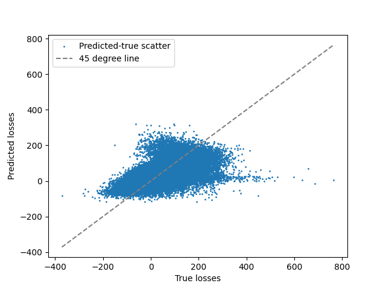
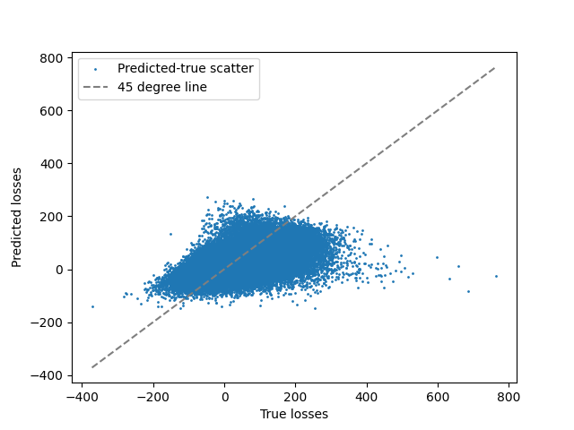
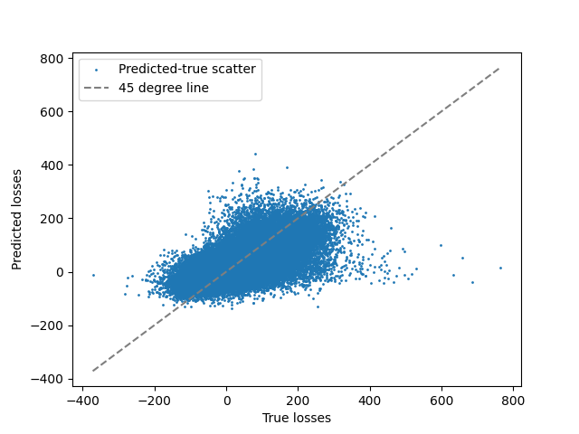
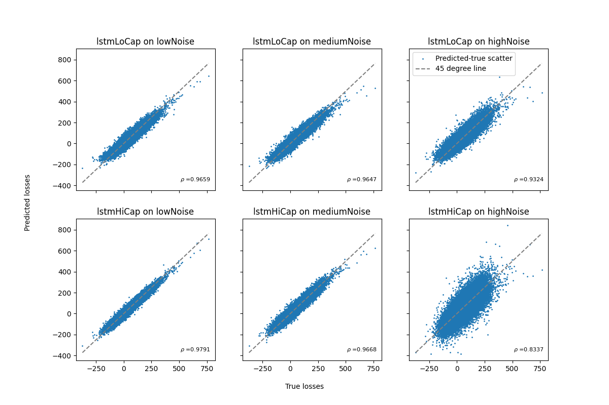
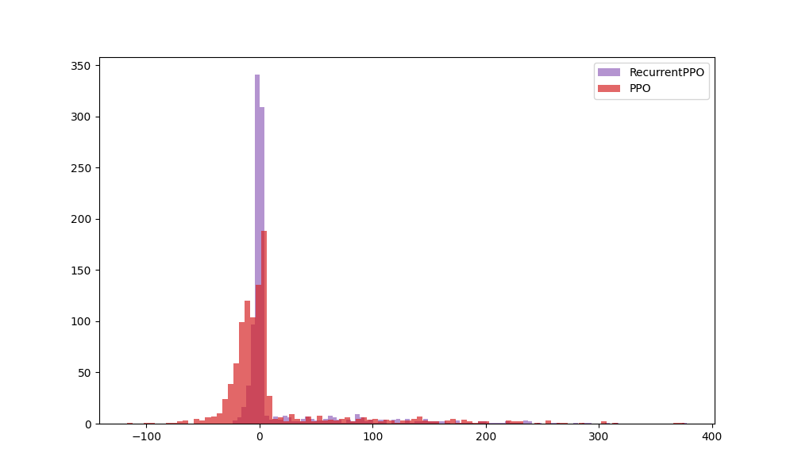
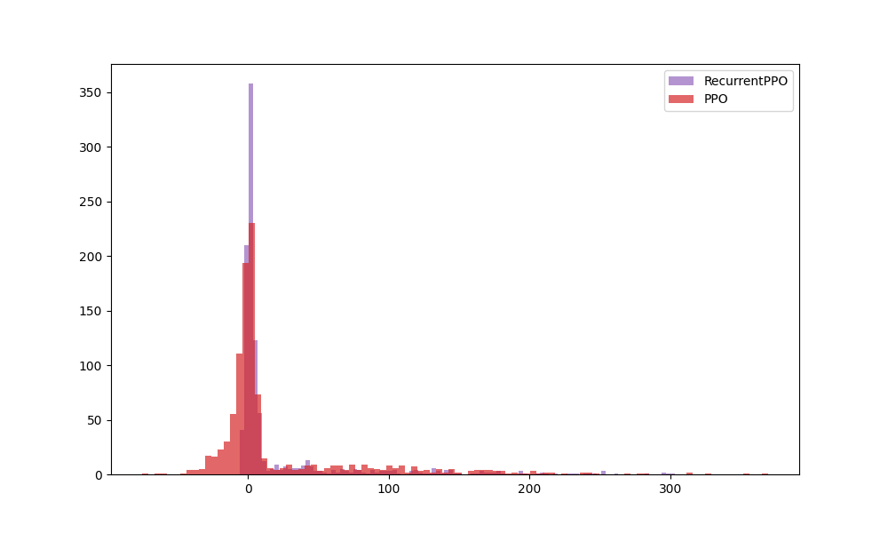
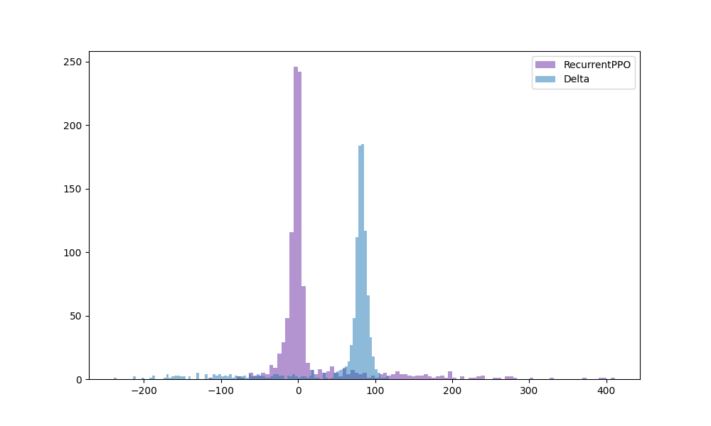
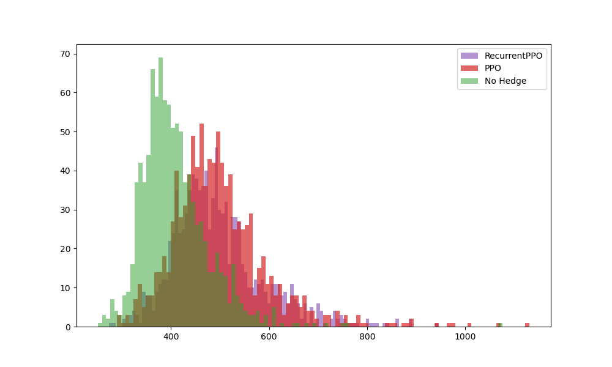

# Resilient Machine Learning Approaches for Fast Risk Evaluation and Management in Financial Portfolios and Variable Annuities

---

## Project 1: Nested Simulation Procedures in Financial Engineering

---

### Introduction

- Nested simulation procedures are used to estimate risk measures for complex financial derivatives portfolios
$$\rho(L) = \rho(L(X)), \;\;\; L(X) = \mathbb{E}\left[ Y|X=x \right]\vert_{x=X}  $$
- Involves two levels of Monte Carlo simulations:
  - Outer level: generates underlying risk factors (outer scenarios), $X_i \sim F_X$
  - Inner level: generates scenario-wise samples of portfolio losses (inner replications), $Y_{ij} \sim F_{Y|X_i}$
- Computationally expensive due to nested structure

---

### Standard Nested Simulation

$$\hat{L}_{N, i} = \frac{1}{N} \sum_{j=1}^N Y_{ij}; ~~~ Y_{ij} \sim F_{Y|X_i} $$

- Proposed by Gordy and Juneja (2010)
- Uses standard MC estimator (sample mean of inner replications)
- Optimal budget allocation between outer scenarios and inner replications
- Computationally expensive and potentially wasteful

---

### Improved Nested Simulation Procedures

1. Regression-based (Broadie et al., 2015)
2. Kernel smoothing (Hong et al., 2017)
3. Likelihood ratio (Feng et al., 2020)
4. Kernel ridge regression (Zhang et al., 2022)
5. Multi-level Monte Carlo (Giles, 2019)

Key idea: Pool inner replications from different outer scenarios

---

### Metamodeling Approach

- Use supervised learning models to approximate the inner simulation model
- Treat inner simulation as a black-box function
- Approximate $L(\cdot)$ with $\hat{L}^{\text{SL}}_{M, N}(\cdot)$
- Use trained model to make predictions for all $X \in \mathcal{X}$

---

### Problem Statement

Minimize MSE of the estimator subject to total simulation budget:

$$
\min_{M, N} \mathbb{E} \left[ \left( \hat{\rho}_{M, N} - \rho \right)^2 \right]
$$

Subject to: $M \cdot N = \Gamma$

Interested in convergence order as $\Gamma \to \infty$

---

### Key Theoretical Results: 

- Most literature focuses on Mean Squared Error (MSE) of estimator $\hat{\rho}$
- Wang et al. (2022) analyze convergence in terms of absolute error and claim to bridge gap between cubic and square root convergence rates

### Definitions

1. Convergence in MSE:
   $\mathbb{E} \left[ \left(\hat{\rho}_{\Gamma} - \rho\right)^2 \right] = \mathcal{O} \left( \Gamma^{-\xi} \right)$

2. Convergence in Probabilistic Order:
   $|\hat{\rho}_{\Gamma} - \rho| = \mathcal{O}_{\mathbb{P}}(\Gamma^{-\xi})$

---

### Key Theorem

**Theorem 1:** If $\hat{\rho}_{\Gamma}$ converges in MSE to $\rho$ in order $\xi$, then $\hat{\rho}_{\Gamma}$ converges in probabilistic order to $\rho$ in order $\frac{\xi}{2}$.

### Implications of Theorem 1

- First result showing connection between MSE and probabilistic order convergence
- Applicable to any nested simulation procedure converging in MSE
- Convergence in MSE implies convergence in probabilistic order

---

### Converse Not Necessarily True

- Convergence in probabilistic order doesn't always imply convergence in MSE
- Probabilistic order convergence is weaker than MSE convergence

### Analysis of Wang et al. (2022)

- Their results show convergence in probabilistic order for absolute error
- Not necessarily equivalent to convergence in MSE
- Bridges the gap, but only in terms of probabilistic order for absolute error

---

### Numerical Experiments

- Compared 6 nested simulation procedures
- Various risk measures: quadratic tracking error, mean excess loss, probability of large loss, VaR, CVaR
- Different portfolios: European calls, geometric Asian options, barrier options
- Asset dimensions: $d = 1, 2, 5, 10, 20$
- $525$ experimental settings, $1000$ macro repetitions each

---

### Key Findings

1. Regression-based method shows fastest and most stable empirical convergence
2. Empirical convergence stable across different:
   - Risk measures
   - Option types
   - Asset dimensions
   - Asset models (GBM vs. Heston)
   - Regression bases

---

### Basic Comparison: European Call Options, d=1

- Most procedures match their asymptotic convergence rates
- Regression and kernel smoothing show higher empirical rates

---

### Sensitivity to Asset Dimension

 

- Standard, KRR, and likelihood ratio methods are dimension-independent
- Kernel smoothing and regression show sensitivity to dimension

---

### Regression-based Method: Detailed Analysis

- Higher initial convergence rate
- Stabilizes to match asymptotic rate at higher budgets
- Consistent across different asset dimensions

---

### Sensitivity to Option Type

 

- Similar convergence patterns across different option types
- Regression and kernel smoothing show higher empirical rates for barrier options

---

### Sensitivity to Risk Measure

 

- Convergence behavior consistent across different risk measures
- Regression-based method shows highest empirical convergence rates

---

### Sensitivity to VaR/CVaR Level

 

- Regression-based method not sensitive to VaR/CVaR level
- Consistent performance across different levels

---

### Sensitivity to Asset Model

 

- Regression-based method insensitive to asset model (GBM vs. Heston)
- Consistent performance across different models

---

### Computational Complexity

- Regression-based: Most efficient among metamodel-based procedures
- Kernel-based methods: More expensive due to distance calculations and cross-validation
- Likelihood ratio: No training, but costly weight calculations
- KRR: Most computationally expensive, especially for large budgets

---

### Computational Complexity

 

- Regression and kernel smoothing most efficient among metamodel-based procedures
- Likelihood ratio and KRR most computationally expensive

---

### Detailed Computational Cost Analysis

 

- Standard method: constant cost for budget allocation
- Regression: linear growth in computational time
- Kernel methods: higher costs due to cross-validation and matrix operations

---

### Conclusions

- Regression-based nested simulation procedure:
  - Most robust and stable for limited budgets
  - Efficient to implement
  - Fast empirical convergence for option portfolios
- For high-dimensional or complex payoffs:
  - Neural network-based procedures may be more suitable
- Future work: Examine performance for variable annuities (Project 2)

---

## Project 2: Using Deep Neural Network Metamodels for High-Dimensional Nested Simulation

---

### Introduction

- Deep neural networks: successful in various machine learning tasks
- Focus on RNNs and LSTMs for sequential data
- Challenge: Lack of transparency and interpretability in financial applications
- Research on noise injection and resilience to label noise

---

### Research Contributions

1. Novel approach to study neural networks using simulated data
   - Control noise levels by adjusting simulation parameters
   - Provide direct evidence on transparency and interpretability

2. Two generic nested simulation procedures using deep neural networks
   - Identify tail scenarios
   - Estimate risk measures directly

---

### Key Questions Addressed

- "What do deep neural networks learn from noisy data?"
- "How well do neural networks learn from noisy data?"

### Our approach
- Use stochastic simulation outputs as training labels
- Control quality and quantity of training data
- Obtain clear-cut answers in a controlled environment

---
### Standard Nested Simulation

1. Generate $M$ outer scenarios ($S^{(i)}, i=1,...,M$)
2. For each outer scenario:
   - Perform $N$ inner simulations
   - Estimate hedging loss $L_i$ for scenario $i$
3. Use estimated losses to calculate risk measures (e.g., $95\%$-CVaR)

- Computational budget: $M * N$ simulations
- Accuracy depends on both $M$ and $N$

---

### A Two-Stage LSTM-based Nested Simulation Procedure

### Stage 1: Metamodel Training

1. Generate $M$ outer scenarios ($S^{(i)}, i=1,...,M$)
2. For each outer scenario:
   - Perform $N'$ inner simulations ($N' << N$)
   - Estimate noisy hedging loss $L_i$ for scenario $i$
3. Train LSTM metamodel on $(S^{(i)}, L_i)$ pairs
4. Use trained metamodel to identify $m$ potential tail scenarios

---

### A Two-Stage LSTM-based Nested Simulation Procedure (Continued)

### Stage 2: Refined Estimation

5. For each identified tail scenario:
   - Perform $N$ inner simulations (same as standard procedure)
   - Estimate refined hedging loss $L_i$
6. Use refined loss estimates to calculate risk measures

- Computational budget: $M * N' + m * N$ simulations
- Typically uses $15\% - 30\%$ of standard procedure's budget
- Accuracy comparable to standard procedure with proper safety margin

---

### Key Advantages of a Two-Stage LSTM-based Procedure 

1. Substantial computational savings ($70\% - 85\%$ reduction)
2. Maintains accuracy comparable to standard procedure
3. LSTM metamodel shows resilience to noisy training data
4. Can distinguish between tail and non-tail scenarios effectively
5. Addresses regulatory concerns by using actual simulations for final estimates

---

### A Single-Stage LSTM-based Nested Simulation Procedure

1. Train LSTM metamodel (same as Two-Stage Procedure stage 1)
2. Use trained LSTM to predict losses for all M scenarios
3. Calculate α-CVaR directly using predicted losses

### Key Advantages of a Single-Stage Procedure
- Uses metamodel predictions to estimate risk measures directly
- More efficient than a two-stage procedure
- Can estimate risk measures requiring full loss distribution
- Avoids calibration of safety margin

---

### Experimental Setup

- Estimating 95% CVaR of hedging loss for GMWB contract
- 20-year maturity, monthly delta-hedging (240 periods)
- Regime-switching geometric Brownian motion for underlying asset
- Benchmark: 100,000 outer scenarios, 100,000 inner replications

---

### Metamodel Architectures Compared

1. Regression (MLR, QPR)
2. Feedforward Neural Network (FNN)
3. Recurrent Neural Network (RNN)
4. Long Short-Term Memory (LSTM)

---

### RNN vs LSTM Performance

 

- LSTM overcomes vanishing gradient problem in RNN
- LSTM better captures long-term dependencies in 240-dimensional time series

---

### Regression vs Neural Network Metamodels

 

- Regression metamodels (MLR, QPR) generalize poorly to true data
- Neural network metamodels show better generalization

---

### LSTM Performance with Different Noise Levels

- LSTM metamodels learn true relationship from low and medium-noise datasets
- High-capacity LSTM prone to overfitting with high-noise data

---

### CVaR Estimates Comparison

- LSTM metamodels consistently outperform standard procedure
- High-capacity LSTM produces most accurate estimates

---

### Single-Stage Procedure Convergence Analysis

- RRMSE decreases as simulation budget increases
- Higher convergence rate with increased data quantity
- Diminishing returns for increasing inner replications (N > 100)
- CVaR estimator converges at ~O(M^(1/3)) for fixed N=10

---

### Key Findings

1. LSTM metamodels show resilience to high levels of noise in training labels
2. Deep neural networks can learn true complex dynamic hedging model despite noisy data
3. Two-stage procedure addresses regulatory concerns by avoiding direct use of metamodel predictions
4. Single-stage procedure is more efficient and versatile for various risk measures
5. Increasing outer scenarios more beneficial than increasing inner replications
6. High-capacity LSTM requires training labels with lower noise

---

### Future Directions

1. Apply deep neural network metamodels to other financial risk management tasks
2. Investigate impact of label noise on other deep learning models (CNNs, Transformers)
3. Explore optimal network architectures for different simulation models

---

## Project 3: Transfer Learning for Rapid Adaptation of Deep Neural Network Metamodels in Dynamic Hedging

---

### Introduction

- Challenge: Adapting deep neural network metamodels to changing conditions
- Problem: Retraining LSTMs from scratch is computationally expensive
- Key issues:
  - Rapid adaptation to new market conditions
  - Efficient incorporation of new VA contract data
  - Balancing model accuracy and computational costs

This project explores transfer learning (TL) to develop adaptable, efficient metamodels for VA dynamic hedging.

---

### Transfer Learning Solution

- Retraining from scratch is computationally inefficient
- TL enables reuse of pre-trained models
- Benefits:
  - Reduced training time and computational resources
  - Enhanced model generalization
  - Quick adaptation to new conditions

---

### Research Objectives

1. Apply TL to dynamic hedging of VAs using RNN and LSTM metamodels
2. Propose a novel TL framework for nested simulation in dynamic hedging
3. Evaluate performance on VA contract datasets
4. Compare TL approach with training from scratch

---

### Transfer Learning Framework

- Pre-train deep neural network on contracts with abundant simulation data
- Fine-tune on smaller dataset of new contracts/market conditions
- Leverages shared features between VA contracts
- Computational savings:
  1. Reduced fine-tuning time
  2. Fewer data points needed for good performance

---

### Key Components

- **Domain** $\mathcal{D}$: Feature space $\mathcal{X}$ + Probability distribution $F$
- **Task** $\mathcal{T}$: Label space $\mathcal{Y}$ + Predictive function $f: \mathcal{X} \rightarrow \mathcal{Y}$

### Source vs. Target

| Component | Source | Target |
|-----------|--------|--------|
| Domain    | $\mathcal{D}_{\text{So}} = \{\mathcal{X}_{\text{So}}, F_{\text{So}}(X)\}$ | $\mathcal{D}_{\text{Ta}} = \{\mathcal{X}_{\text{Ta}}, F_{\text{Ta}}(x)\}$ |
| Task      | $\mathcal{T}_{\text{So}} = \{\mathcal{Y}_{\text{So}}, f_{\text{So}}(\cdot)\}$ | $\mathcal{T}_{\text{Ta}} = \{\mathcal{Y}_{\text{Ta}}, f_{\text{Ta}}(\cdot)\}$ |

---

### Transfer Learning in VA Context

- **Input Features** $X$: Risk factors from outer simulation
- **Output Labels** $L$: Contract losses at each time step
- **Goal**: Improve $f_{\text{Ta}}(\cdot)$ using knowledge from $\mathcal{D}_{\text{So}}$ and $f_{\text{So}}(\cdot)$

### Applications

- Adapt LSTM metamodels to new VA contracts
- Transfer knowledge between different market conditions
- Reduce computational cost for nested simulations

---

### Transfer Learning Techniques

- Fine-tuning
- Layer freezing
- Multi-task learning

---

### Fine-tuning 

1. Pre-train model on large dataset (source task)
2. Transfer learned features to new model
3. Train on smaller dataset (target task) with lower learning rate

### Key Considerations:
- Similarity between source and target tasks
- Appropriate learning rate

---

### Fine-tuning Algorithm for LSTM Metamodels in VA Hedging

**Input**: 
- Source dataset: $\mathcal{D}_{\text{So}} = \{(X_{\text{So}}^{(i)}, L_{\text{So}}^{(i)})\}_{i=1}^{M_{\text{So}}}$
- Target dataset: $\mathcal{D}_{\text{Ta}} = \{(X_{\text{Ta}}^{(i)}, L_{\text{Ta}}^{(i)})\}_{i=1}^{M_{\text{Ta}}}$

**Algorithm**:
1. Train source LSTM metamodel $f_{\text{So}}(\cdot; \theta_{\text{So}})$ on $\mathcal{D}_{\text{So}}$:
   $$\theta_{\text{So}} = \arg\min_{\theta} \frac{1}{M_{\text{So}}} \sum_{i=1}^{M_{\text{So}}} (f_{\text{So}}(X_{\text{So}}^{(i)}; \theta) - L_{\text{So}}^{(i)})^2.$$

2. Initialize target model: $\theta_{\text{Ta}} \leftarrow \theta_{\text{So}}$.

3. Fine-tune $f_{\text{Ta}}(\cdot; \theta_{\text{Ta}})$ on $\mathcal{D}_{\text{Ta}}$:
   $$\theta_{\text{Ta}} = \arg\min_{\theta} \frac{1}{M_{\text{Ta}}} \sum_{i=1}^{M_{\text{Ta}}} (f_{\text{Ta}}(X_{\text{Ta}}^{(i)}; \theta) - L_{\text{Ta}}^{(i)})^2.$$

---

### Layer Freezing

**Input**: 
- Source dataset: $\mathcal{D}_{\text{So}} = \{(X_{\text{So}}^{(i)}, L_{\text{So}}^{(i)})\}_{i=1}^{M_{\text{So}}}$
- Target dataset: $\mathcal{D}_{\text{Ta}} = \{(X_{\text{Ta}}^{(i)}, L_{\text{Ta}}^{(i)})\}_{i=1}^{M_{\text{Ta}}}$

**Algorithm**:
1. Train source model $f_{\text{So}}(\cdot; \theta_{\text{So}})$ on $\mathcal{D}_{\text{So}}$
2. Initialize $\theta_{\text{Ta}} \leftarrow \theta_{\text{So}}$
3. Freeze LSTM layers in $\theta_{\text{Ta}}$
4. Fine-tune unfrozen layers of $f_{\text{Ta}}(\cdot; \theta_{\text{Ta}})$ on $\mathcal{D}_{\text{Ta}}$

**Output**: Adapted model $f_{\text{Ta}}(\cdot; \theta_{\text{Ta}})$ with frozen LSTM layers

**Note**: Choice of layers to freeze depends on similarity between source and target tasks

---

## Experiment Setup

### Data Generating Process
- Low noise dataset from standard nested simulation procedure
- Source tasks: $M_{\text{So}} = 50,000$ samples, $N_{\text{So}} = 100$ inner replications
- Target tasks: $M_{\text{Ta}} = 2,000$ samples, $N_{\text{Ta}} = 100$ inner replications
- 10% of data used for validation (early stopping)

--- 

### VA Contracts and Asset Models
| Contract | Asset Model | Lapse | $M_{\text{So}}$ | $M_{\text{Ta}}$ |
|----------|-------------|-------|----------------|----------------|
| GMMB     | GBM         | No    | 50,000         | N/A            |
| GMMB     | RS-GBM      | No    | 50,000         | 2,000          |
| GMMB     | RS-GBM      | Static| 50,000         | 2,000          |
| GMMB     | RS-GBM      | Dynamic| 50,000        | 2,000          |
| GMWB     | RS-GBM      | Dynamic| N/A           | 2,000          |

---
### Transfer to GMMB (No Lapse → Static Lapse)

---
### Fine-Tuning on GMMB (Static → Dynamic Lapse)

- Performance depends on source-target similarity
- Fine-tuning from static lapse → faster convergence
- Appropriate source task selection is crucial

---

### Layer Freezing on GMMB (Static → Dynamic Lapse)

- Freezing LSTM layers → higher validation error
- Freezing FC layer → lower error, better generalization
- Choice of frozen layers impacts performance

---

### Transfer Across Contract Types (GMMB → GMWB)

---

### Performance Comparison (GMMB → GMWB)

| Model | Training MSE | True MSE |
|-------|--------------|----------|
| Without TL | 0.3588 | 0.4188 |
| Fine Tuning | 0.1690 | 0.1780 |
| Layer Freezing | 0.1828 | 0.2295 |
| Extensive Training | 0.0853 | 0.0726 |

- Fine-tuning outperforms layer freezing for dissimilar tasks
- Both TL methods better than training from scratch
- Extensive training still superior with abundant data

---

# Key Findings

1. TL improves stability and performance with limited data
2. Source-target similarity crucial for effective transfer
3. Fine-tuning generally outperforms layer freezing for dissimilar tasks
4. Layer freezing can be effective for closely related tasks
5. TL enables faster adaptation to new VA contracts and features
6. Choice of frozen layers impacts performance on target tasks

---

### Multi-task Learning Framework

- LSTM layers shared across multiple tasks
- Task-specific fully connected layers
- Objective: Minimize sum of loss functions across all tasks

---

### Multi-task Learning Framework 

**Input**: 
- Set of $K$ tasks $\{\mathcal{T}_k\}_{k=1}^K$ with datasets $\mathcal{D}_k = \{(X_k^{(i)}, L_k^{(i)})\}_{i=1}^{M_k}$
- Shared parameters $\theta_0$ and task-specific parameters $\theta_k$ for each task $k$
  
**Algorithm**:
1. Train the multi-head LSTM metamodel on all $K$ tasks simultaneously by minimizing the multi-task loss function:

   $$\min_{\theta_0, \{\theta_k\}_{k=1}^K} \sum_{k=1}^K \frac{1}{M_k} \sum_{i=1}^{M_k} \left( f_i(X_k^{(i)}; \theta_0, \theta_k) - L_k^{(i)} \right)^2$$

2. Update both the shared parameters $\theta_0$ and task-specific parameters $\{\theta_k\}_{k=1}^K$ simultaneously using backpropagation and gradient descent with learning rate $\alpha$

**Output**: Trained multi-task LSTM metamodel $f(\cdot; \theta_0, \{\theta_k\}_{k=1}^K)$ for all $K$ tasks

---

### Multi-task Learning of GMMB and GMWB

---

### Conclusions

1. TL framework accelerates LSTM metamodel training for VA dynamic hedging
2. Fine-tuning improves training stability and predictive accuracy
3. Layer freezing effectiveness depends on task similarity
4. Multi-task learning enhances generalization across VA contracts
5. Significant advancement in robust risk management for VAs

---

### Future Directions

- Broader applications of transfer learning in financial modeling
- Exploration of other deep learning architectures for metamodeling
- Integration of transfer learning techniques in regulatory frameworks

---

## Future Work: Deep Hedging Variable Annuities with Transfer Learning

---

### What We've Tried

1. Applied Proximal Policy Optimization (PPO) to VA hedging
2. Compared recurrent PPO with LSTM to standard PPO
3. Tested PPO against traditional delta hedging
4. Experimented with different asset models and VA riders

---

### Recurrent PPO vs Deep Hedging

- Compared recurrent PPO with LSTM to deep hedging algorithm
- Both methods applied to GMMB rider
- Recurrent PPO shows competitive performance

---

### Standard PPO vs Recurrent PPO

 

- Recurrent PPO outperforms standard PPO for both GBM and regime-switching GBM
- LSTM component helps capture historical information, improving hedging decisions

---

### PPO vs Delta Hedging with Transaction Costs

 

- Delta hedging outperforms PPO with low transaction costs
- PPO adapts better as transaction costs increase
- Demonstrates PPO's ability to learn from the environment

---

### PPO Performance with Model Information

- Tested PPO with and without model information (asset model, current liability value)
- Surprisingly, additional information didn't significantly improve performance
- Suggests PPO can learn effective strategies without explicit model knowledge

---

### Challenges: PPO with GMWB

- PPO struggled with GMWB rider
- Hedging errors more dispersed compared to GMMB
- Indicates need for more training or enhanced approaches for complex VA products

---

### Where We've Faced Challenges

1. GMWB hedging: PPO struggled with increased complexity
2. Sample efficiency: More episodes needed for satisfactory performance on complex products
3. Generalization: Difficulty in transferring knowledge between different VA riders
4. Computational costs: High resources required for training, especially for complex scenarios
5. Model-free limitations: Current approach may not fully leverage available financial knowledge

---

### Future Directions: Adressing the Challenges

1. Enhance sample efficiency of RL algorithms for complex VA products
2. Develop more robust transfer learning techniques between VA types
3. Explore hybrid approaches combining model-based and model-free methods
4. Investigate meta-learning for faster adaptation to new market conditions
5. Improve interpretability of RL models for regulatory considerations
6. Extend to more complex market models (e.g., stochastic volatility, jump diffusion)
